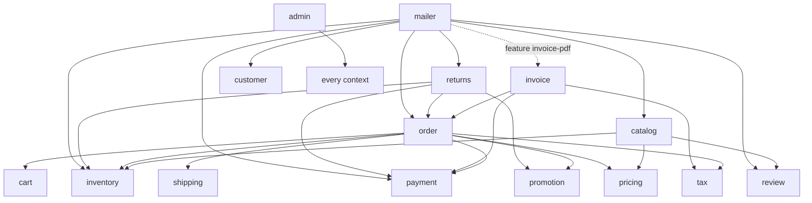
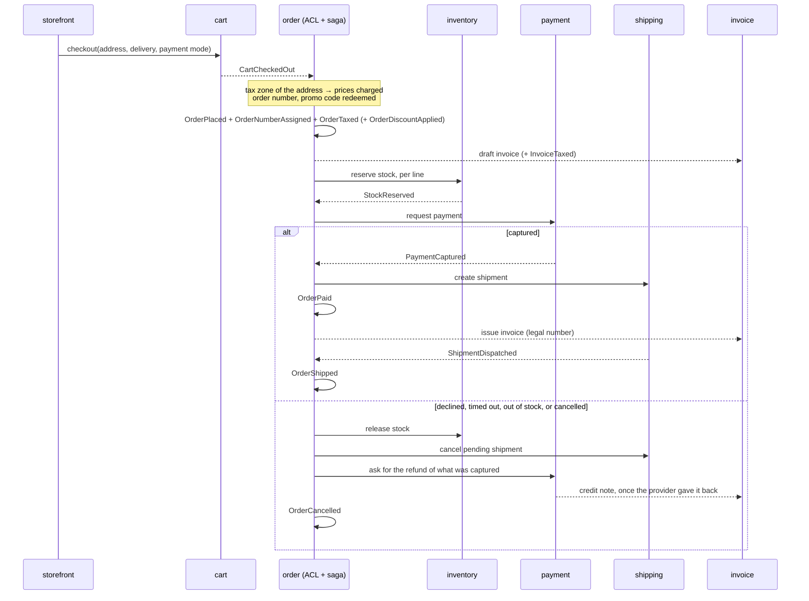

# Architecture

Timada is a set of libraries. A **host** — your binary, or `demo/` — opens a
SQLite database, runs the migrations, starts the subscriptions, and serves
whatever UI it wants on top. Nothing in `crates/` listens on a socket or reads
the environment.

## Bounded contexts

Each context is a crate with the same layout (it mirrors evento's `bank`
example):

```
src/aggregator.rs      #[evento::aggregate(name = "timada-<ctx>/<Enum>")] — the events
src/command/<verb>.rs  one file per command; Command borrows &Executor
src/query/<view>.rs    projections loaded on demand (snapshotted through the executor)
src/<list>.rs          SQL read models + the subscription that feeds them
src/process.rs         anti-corruption layers and process managers
src/migration.rs       sqlx_migrator migrations of the context's SQL tables
src/value_object.rs    types nested in events and views
src/error.rs
tests/<ctx>.rs         integration tests on an in-memory database
```

A context exposes commands (writes), `load_*` functions and SQL queries
(reads), and subscription builders (what reacts to events). UIs are clients of
those three things and never touch events.

### Who depends on whom

Most contexts are leaves over `timada-core`. The ones that coordinate others:



`pricing`, `inventory`, `customer`, `cart`, `promotion`, `payment`,
`shipping`, `review` and `tax` depend on `core` only. `catalog` reads three of
them for one thing: the **listing** the storefront browses
(`catalog_listing`) carries each product's price, deliverable stock and
rating, so that filtering, sorting and paging are a single query. A leaf never learns about
the context that consumes it: `payment` knows nothing of orders beyond an
opaque `order_id`.

Contexts talk through **facts**, not calls into each other's internals:

- an **anti-corruption layer** (ACL) subscribes to another context's event and
  translates it into a command of its own — `order` places an order when
  `cart` says `CartCheckedOut`; `invoice` drafts one when `order` says
  `OrderPlaced`; `invoice` issues a credit note when `payment` says
  `PaymentRefunded`;
- a **process manager** (saga) holds the state of a long-running process in its
  own aggregate and drives several contexts — `OrderFulfillment` in `order`,
  `return-processing` in `returns`.

### The life of an order



A zero-total order (a voucher covering everything, free delivery) skips the
payment leg: `OrderSettled` instead of `OrderPaid`. After shipping, the way
back is a **return**: request → approve/refuse → receive (what is taken back,
what goes into stock again, money or store credit) → the process manager
restocks, refunds and completes; the refund gets its credit note and its
e-mail through the same subscriptions as any other refund.

**Money moves at the payment provider**, which the payment context sees as a
`PaymentProvider` the host picks (`ManualProvider` when there is none: an
operator captures from the admin, and refunds settle at once).

- *Paying*: the storefront calls `start_payment` once the payment is
  requested and shows what comes back — the provider's page, its embedded
  form, or nothing. The provider's own word is the only source of a capture:
  the host checks its webhook's signature, turns it into a `ProviderEvent` and
  hands it to `apply_provider_event`. A payment that *fails* is no event — the
  shopper tries again on the same session — and only the timeout declines,
  after calling the session off (a shopper who paid in that very moment is
  captured, not timed out). Money that still arrives for a declined payment,
  or in the wrong amount, is sent straight back.
- *Refunding* is two-phase: `refund_payment` records `RefundRequested` (the
  shop's decision; its amount is held against the captured amount), the
  refund worker hands it to the provider, and only the provider's answer
  writes `PaymentRefunded` — with its companion `RefundSettled` — or
  `RefundFailed`. So `PaymentRefunded` means *the money went back*: credit
  notes, the refund e-mail and the refunds journal all wait for it. Trouble
  reaching the provider stays in SQL and is retried; a refund the provider
  refuses for good waits for the operator, who asks again or settles it by
  hand. A return completes as soon as its refund is asked for.

With **Stripe** (feature `stripe`, a thin client over three REST calls, no
SDK) a payment is one PaymentIntent — created under the payment's id as
idempotency key, so two tabs open one intent, and carrying the payment and
order ids as metadata, which is how `payment_intent.succeeded` finds its way
back. The shopper pays on Stripe's Payment Element: the card fields live in
Stripe's frames and never touch the shop (PCI SAQ-A). The capture's reference
is the intent's id, which refunds are made against; a refund Stripe takes as
`pending` settles on `refund.updated`. A cancelled intent can never be paid,
so the timeout leaves no window for a payment on a cancelled order.

Every handler is idempotent — derived ids, status guards, idempotency keys —
so a redelivery after a crash converges instead of duplicating.

## Where state lives

| Kind | Where | Examples | May it change shape? |
|---|---|---|---|
| Events | evento's event store | `OrderPlaced`, `StockReserved` | **never** — add a variant ([event evolution](event-evolution.md)) |
| Write-side state | rebuilt per command, `#[evento::snapshot(none)]` | `OrderState`, `CartState` | freely |
| Views | folded from one stream, snapshotted | `OrderDetailsView`, `InvoiceView` | with a `.revision(n)` bump |
| SQL read models | the context's tables | `order_history`, `invoice_list`, `return_list` | with a migration |
| Contended counters | write-side SQL under `BEGIN IMMEDIATE` | invoice / order / RMA numbers, promo redemptions, returnable units | with a migration |
| Operational data | SQL, never events | credentials and sessions, the mailer outbox, the provider's payment sessions and the refunds on their way to it | with a migration |

Rules of thumb that fall out of it:

- A list or a search is a SQL read model; a single thing is a view.
- A uniqueness or a counter across aggregates is SQL, taken in the same
  transaction as its check — never counted from events.
- Credentials, sessions and anything a regulation may ask you to erase stay
  out of the event store.
- `events.lock` records every persisted shape; `cargo test` fails when one is
  edited.

## Wiring a host

`demo/src/db.rs` and `demo/src/main.rs` are the reference. In short:

**1. Migrations** — evento's, then every context that has SQL:

```rust
let mut migrator = evento::sql_migrator::new::<Sqlite>()?;
for migrations in [
    timada_catalog::migrations(), timada_cart::migrations(), timada_inventory::migrations(),
    timada_review::migrations(), timada_customer::migrations(), timada_order::migrations(),
    timada_payment::migrations(), timada_invoice::migrations(), timada_promotion::migrations(),
    timada_mailer::migrations(), timada_returns::migrations(), timada_admin::migrations(),
] { migrator.add_migrations(migrations)?; }
```

**2. Subscriptions** — each is started once (`.start(&executor)`), with the
pool as data unless noted:

| Context | Subscription | Kind | Extra data |
|---|---|---|---|
| catalog | `product_list_subscription`, `category_list_subscription` | read models | |
| catalog | `listing_subscription` | read model ← catalog, pricing, inventory, review | |
| cart | `saved_cart_list_subscription` | read model | |
| inventory | `stock_list_subscription`, `alert_list_subscription` | read models | |
| inventory | `back_in_stock_subscription` | process | |
| review | `product_summary_subscription`, `review_list_subscription`, `question_list_subscription` | read models | |
| customer | `customer_list_subscription` | read model | |
| promotion | `code_list_subscription` | read model | |
| payment | `refund_list_subscription` | read models (refunds made, refunds asked for) | |
| payment | `refund_execution_subscription` | process: enqueues refunds for the provider | |
| order | `order_history_subscription`, `payment_deadline_subscription` | read models | |
| order | `order_checkout_subscription` | ACL ← cart | `timada_tax::TaxZones` |
| order | `order_fulfillment_subscription` | saga | *(no pool)* |
| order | `order_promo_release_subscription` | ACL → promotion | |
| invoice | `invoice_from_orders_subscription` | ACL ← order | |
| invoice | `credit_notes_from_refunds_subscription` | ACL ← payment | |
| invoice | `invoice_list_subscription`, `credit_note_list_subscription` | read models | |
| invoice | `vat_journal_subscription` | read model: the VAT of issued invoices and credit notes, per rate | |
| returns | `return_processing_subscription` | process manager | |
| returns | `return_list_subscription` | read model | |
| mailer | `mailer_subscription` | ACL ← seven contexts (eight with `invoice-pdf`) | `timada_mailer::MailerConfig`, optionally `MailerTemplates`; with feature `invoice-pdf`, a `timada_invoice::InvoiceIssuer` turns on the invoice e-mail |

Read-model subscriptions are `.strict()`: they name every event of their
aggregate (a handler or a `.skip`), so a new event cannot be forgotten
silently. A handler that keeps failing is retried forever — a missing
`.data(..)` shows up as a test that hangs, not one that fails.

**3. Background workers** — three loops to spawn:

```rust
tokio::spawn(timada_order::run_payment_timeouts(executor, pool, provider, timeout, every));
tokio::spawn(timada_payment::run_provider_refunds(executor, pool, provider, every)); // any number of these
tokio::spawn(timada_mailer::run_delivery(pool, transport, every));   // any number of these
```

**4. Values the host provides** — plain structs, no events behind them:

| Value | For |
|---|---|
| `timada_tax::TaxZones` | where the shop delivers, how each zone is taxed, which delivery methods serve it. `default()` = France + overseas exports; `france_with_eu_oss()` adds the 26 other member states at their own VAT, reduced rates mapped by the host with `with_mapped_rate(zone, listed_bp, destination_bp)` |
| `Arc<dyn timada_payment::PaymentProvider>` | who takes the money and gives it back; `ManualProvider` when there is none, `StripeProvider` (feature `stripe`), `FakeProvider` in tests. The storefront offers only the payment methods it `supports` |
| `timada_returns::ReturnPolicy` | how long after shipping a return may be asked for |
| `timada_mailer::MailerConfig` | sender, shop name, base URL, returns address, maximum event age |
| `timada_mailer::MailerTemplates` | *optional* — the host's own wording of any e-mail (another language, an HTML alternative); the built-in French texts otherwise |
| `timada_invoice::InvoiceIssuer` | the seller's identity printed on invoices — also handed to the mailer subscription when invoices are e-mailed |
| `timada_admin::AdminConfig` | mount segment, stylesheet, invoice issuer, how long a paid order may wait for its parcel before the admin flags it (`ship_within`, two days by default) |

**5. The admin** — see [its README](../crates/admin/README.md). It is mounted
under its real prefix (never a prefix-stripping mount), and a topcoat host must
use explicit page paths rather than `module_router!()`.

**6. What stays the host's** — shopper accounts and sessions, the storefront,
the payment provider's webhook route — raw body and signature header to
`StripeProvider::parse_webhook`, the event to `apply_provider_event`, 2xx
unless applying failed — and the page of the embedded card form with its
`Content-Security-Policy` (the demo's `/webhooks/stripe` and
`/checkout/pay/{order_id}` show both; without Stripe keys its payments are
captured by hand from the admin), and
the SMTP relay.

## Conventions

- **Names are forever.** An aggregate pins `name = "timada-<ctx>/<Enum>"`; a
  variant's identifier is the stored event name.
- **Deterministic ids** where one thing exists per natural key:
  `timada_core::id::derived(&[key], kind)` — product (SKU), price / payment /
  shipment / invoice / fulfillment (order id), order (cart id), review
  (product, customer), alert (product, customer), discount / voucher (code),
  credit note (refund event id), return (RMA number), category (slug). Creating on a derived id
  with `evento::append(&id)` is an atomic create-unless-exists.
- **What the storefront lists is one table.** `listing_subscription` rewrites
  a product's row — and its full-text entry (SQLite FTS5, accents folded,
  prefixes matched) — with absolute values whenever the catalog, its price,
  the warehouse's stock, a published review or its category's place changes.
  `search_listing` answers a page, the total and the facets in one go; each
  facet is counted with every *other* filter applied, so a second brand can
  always be picked. Beyond the fixed facets — brand, price, stock, rating —
  a category is filtered by the lines of the **technical sheet** its operator
  picked (`CategoryFacetsDefined`, inherited by the categories below until
  one has a list of its own): values match exactly, so a value is spelled the
  same way on every product; they are offered in numeric order. A product is listed while it is not archived and has a
  price; a product under an archived category stays listed under what is
  above it. A new deployment of the subscription builds the table from the
  whole history.
- **VAT is read from the documents.** `vat_journal_subscription` keeps a row
  per VAT rate of each *issued* invoice, and a negative one per credit note —
  its amount spread over the invoice's rates in proportion to what each was
  charged. `vat_report(db, VatPeriod)` reads a calendar quarter as three
  returns: the shop's own VAT, the one-stop-shop return by member state of
  delivery and rate, and exports. A credit note nets the sale when both fall
  in the same quarter; on an invoice of an earlier quarter it is a
  *correction of that quarter* in the one-stop-shop return, while the
  domestic return simply deducts it. Invoices from before tax zones carry no
  breakdown and are reported apart.
- **Categories are managed, and their address is for ever.** A category's id
  derives from its slug, so links never break whatever it is renamed to or
  moved under; archiving one takes its whole branch off the storefront while
  its products stay on sale. A product is filed under one category
  (`ProductCategorised`, again to move it); the `category_path` of
  `ProductCreated` is only the label from before — a shop with such history
  calls `timada_catalog::adopt_category_paths` once, which opens the
  categories those labels name and files the products.
- **Companion events** carry what an event cannot gain: `OrderTaxed`,
  `OrderNumberAssigned`, `OrderDiscountApplied` are committed in the same batch
  as `OrderPlaced`. Consumers that need them load the view, not the payload.
- **Money** is an integer of minor units plus a currency; arithmetic is
  checked. Listed prices include the domestic VAT; a tax zone decides what is
  charged from there.
- **Destination VAT** (EU one-stop shop) has no product tax category: a
  product only knows the rate it is listed with, and each country's zone maps
  that rate to its own (`5,5 % → 7 %` in Germany), falling back to the
  country's standard rate — too much VAT rather than too little when the host
  mapped nothing. The built-in standard rates are those of 1 January 2026;
  keeping them current is the host's job.
- **One document, several renderings**: `timada_invoice::InvoiceDocument` is
  what an issued invoice says; the storefront and admin print pages and
  `render_invoice_pdf` (feature `pdf`: krilla, bundled Noto Sans under the
  OFL, laid out as data before it is drawn) only present it. The admin offers
  the file with its own `pdf` feature.
- **E-mail attachments** are queued with their e-mail in one transaction
  (`mailer_attachment`), survive failed attempts, and lose their bytes once
  the e-mail is sent — name and size stay for the admin. The outbox is not an
  archive: what was attached can be rendered again.
- **Logging** goes through `tracing`; libraries never print.
- **Errors**: `thiserror` enums per context, with `anyhow` for the
  infrastructure underneath. No `unwrap`/`expect` outside tests.
- **Time**: events carry their timestamp; ULID ids created within the same
  millisecond have no order — tests asserting "newest first" space their
  writes.
- **The UI is French**, like the shop it was modelled on; domain errors are in
  English and translated at the edge.

## What is deliberately not here yet

- Payments beyond the card form: disputes and chargebacks (a lost dispute
  takes the money back without any refund of ours), saved cards, instalments
  through a provider (Stripe takes cards only here), reconciliation with the
  provider's payouts, and a second provider.
- VAT outside the consumer case: B2B reverse charge (no VAT number is
  collected), the territories of a member state outside the EU VAT area (they
  share their country's code), multi-currency. The quarterly report
  (`timada_invoice::vat_report`, the admin's TVA section) adds up what was
  invoiced; filing it — and the rule that a quarter starts at midnight UTC,
  not Paris time — stays with the accountant.
- An archive of invoice files: the PDF is rendered from the events each time
  it is asked for (same invoice, same bytes — but a change of issuer address
  or of layout shows on past invoices too). Storing the bytes at issue, with
  a hash, is what a 10-year retention policy would add.
- Upcasting of old event shapes: an evento feature, to build when the first
  `V2` event exists.
